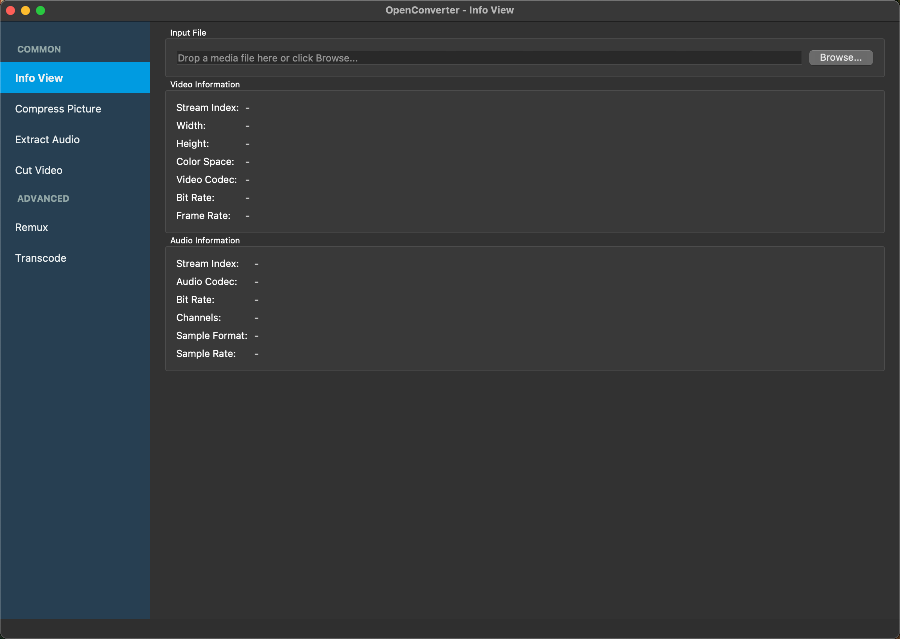
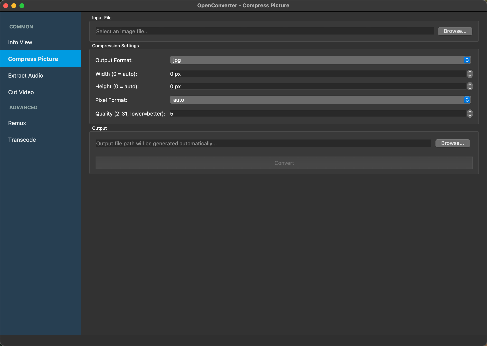
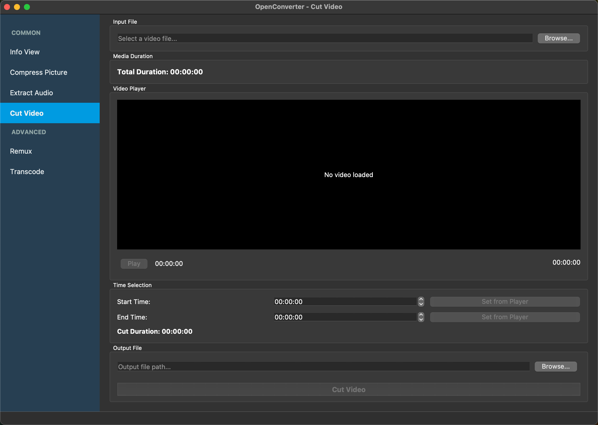

# OpenConverter

[](https://sonarcloud.io/summary/new_code?id=OpenConverterLab_OpenConverter)

## 📢 Project Introduction

OpenConverter is software built on the [**FFmpeg**](https://ffmpeg.org/), [**Qt**](https://www.qt.io/), and [**BMF**](https://babitmf.github.io). It provides simple and user-friendly tools to convert, edit, and process audio and video files.

The converter includes the following main features:

1. Supports changing video/audio codecs for encoding (e.g., libx264, libx265, aac, ac3) with resolution scaling and pixel format conversion.
2. Supports lossless multimedia conversion.
3. Displays information about video and audio streams in multimedia files.
4. Compresses images with format and quality control.
5. Extracts audio from video files.
6. Cuts video with built-in FFmpeg-based player and precise time selection.
7. **Batch processing with queue management for multiple files**.
8. Shows smooth progress tracking and accurate remaining time while converting files.
9. Allows runtime switching of transcoding cores (FFmpeg, FFTool, BMF).
10. Provides both GUI and Command Line Interface (CLI) for flexible usage.

This project is developed using the [Qt framework](./doc/Qt.md), the FFmpeg library, and the [BMF framework](https://github.com/BabitMF/bmf).

For FFmpeg development tutorials, refer to [Learn FFmpeg the Hard Way](https://github.com/TSGU-OSC/Learn_FFmpeg_the_Hard_Way).

## 🌟 Feature Details

After running OpenConverter, you can see and use the following features:

<div align="center">







</div>

### 1. Support for Changing Audio and Video Codecs for Encoding (e.g., libx264, libx265, aac, ac3)

This converter allows users to easily change audio and video codecs. For example, you can choose to use the libx264 or libx265 encoder for higher compression rates and better video quality.

Additionally supports:
- **Resolution scaling** (e.g., 1920x1080 → 1280x720, 4K → 1080p)
- **Pixel format conversion** (e.g., yuv420p, yuv444p, rgb24)
- Bitrate control for both video and audio
- Quality control with qscale parameter

### 2. Support for Lossless Multimedia Conversion

The converter also supports lossless multimedia conversion. This means you can directly convert files from one format to another without re-encoding the original video and audio streams. This is very useful for quick file conversions.

### 3. Display Information About Video and Audio Streams

This converter can display detailed information about video and audio streams, including resolution, frame rate, bitrate, etc. This helps you understand the properties of multimedia files for making appropriate adjustments during conversion.

### 4. Image Compression

Compress images with customizable settings:
- Format conversion (JPEG, PNG, WebP, BMP)
- Resolution adjustment
- Quality control (1-31)

### 5. Audio Extraction

Extract audio from video files with codec selection:
- Multiple audio formats (MP3, AAC, AC3, FLAC, WAV)
- Bitrate control

### 6. Video Cutting

Cut video segments with precision:
- Built-in FFmpeg-based video player
- Real-time playback and seeking
- Accurate start/end time selection
- Supports all FFmpeg-compatible formats

### 7. Batch Processing

Process multiple files efficiently:
- **Visual file filter management** with tag-based interface
- Add files individually or scan entire directories
- Queue management with progress monitoring
- Configurable output directory and file suffix
- Support for transcode, extract audio, compress picture, and create GIF operations
- Real-time progress tracking for each file in the queue

### 8. Advanced Progress Tracking and Time Estimation

During file conversion, the player provides:
- Smooth progress updates with UI-friendly refresh rates
- Accurate remaining time estimation using duration smoothing
- Real-time progress percentage and duration tracking
- Detailed console output for monitoring conversion status

### 9. Runtime Switching of Transcoding Cores (FFmpeg, FFTool, BMF)

The software offers three different transcoding cores to choose from:
- FFmpeg API-based core for direct library integration
- FFTool core for command-line tool integration
- BMF framework-based core for advanced processing
You can also selectively compile these cores based on your needs.

### 10. Command Line Interface (CLI) Support

Usage in non-GUI mode:
```bash
> ./OpenConverter
Usage: ./OpenConverter [options] input_file output_file
Options:
  --transcoder TYPE        Set transcoder type (FFMPEG, BMF, FFTOOL)
  -v, --video-codec CODEC  Set video codec (could set copy)
  -q, --qscale QSCALE      Set qscale for video codec
  -a, --audio-codec CODEC  Set audio codec (could set copy)
  -b:v, --bitrate:video BITRATE    Set bitrate for video codec
  -b:a, --bitrate:audio BITRATE    Set bitrate for audio codec
  -pix_fmt PIX_FMT         Set pixel format for video
  -scale SCALE(w)x(h)      Set scale for video (width x height)
  -ss START_TIME           Set start time for cutting (format: HH:MM:SS or seconds)
  -to END_TIME             Set end time for cutting (format: HH:MM:SS or seconds)
  -t DURATION              Set duration for cutting (format: HH:MM:SS or seconds)
  -h, --help               Show this help message

Note: Use either -to or -t, not both. If both are specified, -to takes precedence.
```

Example:
```bash
# Convert video using FFmpeg core with H.264 video codec
./OpenConverter -t FFMPEG -v libx264 input.mp4 output.mp4

# Convert video using BMF core with H.265 video codec and AAC audio codec
./OpenConverter -t BMF -v libx265 -a aac input.mp4 output.mp4
```

## User Guide

If you encounter any issues during operation, feel free to check our [User Guide Documentation](./doc/OpenConverter_Usage.md).

## 📖 Contribution Guide

If you are interested in contributing to the project or have found any bugs, please refer to our [Contribution Guide](./CONTRIBUTING.md).

## ☘️ License

OpenConverter is open-source software licensed under the Apache 2.0 License. Please read the [LICENSE](./LICENSE) file before use.
